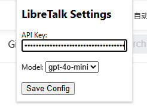
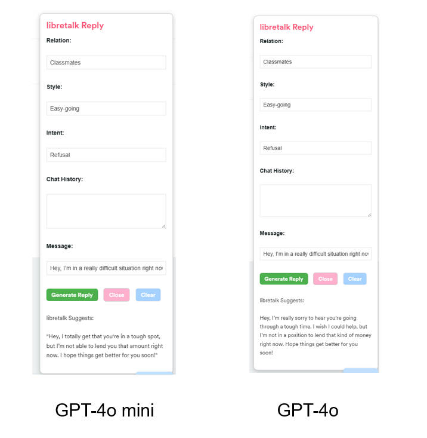

# LibreTalk

**LibreTalk — Speak Freely, Connect Kindly**  
*自由说话，善意沟通*

---

## 🌟 Vision
In modern communication, we often face a dilemma:  
- Being too direct may hurt others.  
- Being too indirect suppresses our true thoughts.  

**LibreTalk** helps people break free from this struggle.  
It enables you to **express yourself freely** while keeping your words **gentle, empathetic, and constructive**.  

---

## 🚀 Features
- **AI-Powered High-EQ Replies**: Generate natural and sincere responses based on context.  
- **Context Awareness**: Supports input such as relationship, style, chat history, and intent.  
- **One-Click Copy**: Copy replies instantly after generation.  
- **Floating Assistant**: Quick access via a button fixed at the bottom right of any webpage.  

---

## 🛠️ Installation
1. Clone or download this repository.  
2. Open Chrome and navigate to `chrome://extensions/`.  
3. Enable **Developer mode**.  
4. Click **Load unpacked** and select the `LibreTalk/` folder.  
5. Once installed, you will see the LibreTalk icon in your browser toolbar.  

---

## 💡 Usage
1. On the first run, launch the **LibreTalk** extension:  
   - Enter your **Base Url** (only required once; it will be automatically loaded when Chrome restarts, no need to re-enter).  
   - Enter your **API Key** (only required once; it will be automatically loaded when Chrome restarts, no need to re-enter).  
   - Select the **Model**.  
   - Click **Save Config** to store settings.  
2. Open any webpage (WeChat Web, Slack, Gmail, etc.).  
3. Click the **LibreTalk floating button** at the bottom right.  
4. Fill in the following fields:  
   - Relationship (e.g., friend, boss, client)  
   - Style (e.g., formal, humorous, casual)  
   - Chat history  
   - Message from the other person  
   - Your intent  
5. Get the **AI-suggested reply** → Copy with one click → Paste into your chat.  

---

## 📸 Screenshots

---

## 🔒 Privacy
- Your API Key is stored locally in Chrome Storage.  
- LibreTalk **does not collect or upload** any personal data.  

---

## 🛤️ Roadmap
- [ ] OCR to automatically capture chat history  

---

## 🤝 Contributing
Contributions are welcome!  
- Fork this repository  
- Submit a PR  
- Open an Issue for suggestions or bug reports  

---

## 📜 License
MIT License © 2025 LibreTalk
