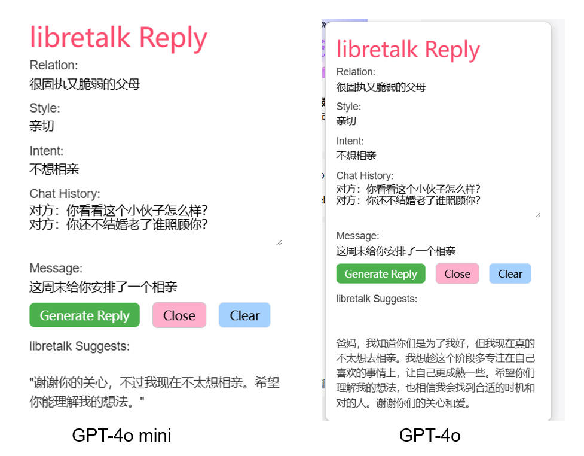

# LibreTalk

**LibreTalk — 自由说话，善意沟通**  
*Speak Freely, Connect Kindly.*

---

## 🌟 愿景
在现代交流中，我们常常面临两难：  
- 过于直接，可能会伤害对方；  
- 过于委婉，又压抑了真实想法。  

**LibreTalk** 希望帮助人们摆脱这些困扰。  
它让你能够 **自由表达**，同时保证表达方式 **温和、体贴、有建设性**。  

---

## 🚀 功能
- **AI 高情商回复**：根据上下文生成真诚、自然的回应。  
- **上下文感知**：支持输入关系、风格、聊天历史和意图。  
- **一键复制**：生成回复后即可快速复制粘贴。  
- **悬浮助手**：在任意网页右下角提供快捷按钮，随时调用。  

---

## 🛠️ 安装
1. 克隆或下载本仓库。  
2. 打开 Chrome 浏览器，访问 `chrome://extensions/`。  
3. 开启 **开发者模式**。  
4. 点击 **加载已解压的扩展程序**，选择 `LibreTalk/` 文件夹。  
5. 安装完成后，你会在浏览器右上角看到 LibreTalk 图标。  

---

## 💡 使用
1. 第一次使用时，启动**LibreTalk**插件：  
   - 输入 **Base Url**（只需设置一次，之后启动 Chrome 会自动加载，无需重复输入）  
   - 输入 **API Key**（只需设置一次，之后启动 Chrome 会自动加载，无需重复输入）  
   - 选择 **模型**  
   - 点击 **Save Config** 保存  
2. 打开任意网页（微信、Slack、Gmail 等）。  
3. 点击页面右下角的 **LibreTalk 悬浮按钮**。  
4. 输入以下内容：  
   - 关系（朋友、上司、客户等）  
   - 风格（正式、幽默、随和等）  
   - 聊天历史  
   - 对方消息  
   - 你的意图  
5. 获取 **AI 建议回复** → 一键复制 → 粘贴到聊天。  

---

## 📸 截图

---

## 🔒 隐私
- API Key 仅存储在本地的 Chrome Storage 中。  
- LibreTalk **不会收集或上传** 任何个人数据。  

---

## 🛤️ 路线图
- [ ] OCR自动捕捉历史聊天记录

---

## 🤝 贡献
欢迎贡献！  
- Fork 本仓库  
- 提交 PR  
- 提交 Issue 提出建议或报告 Bug  

---

## 📜 许可
MIT License © 2025 LibreTalk
